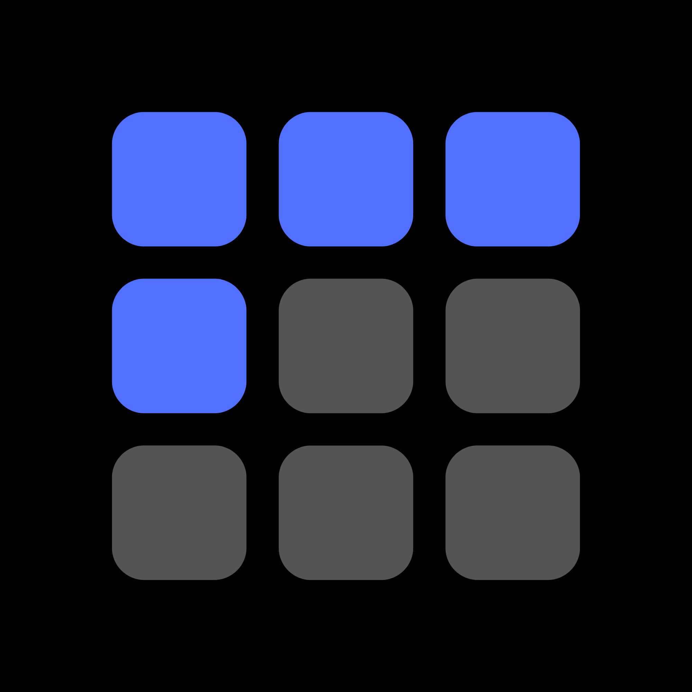
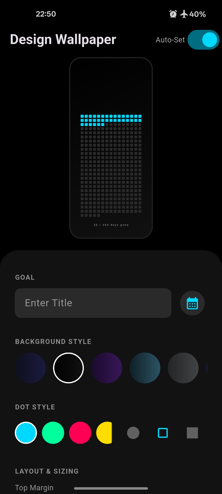
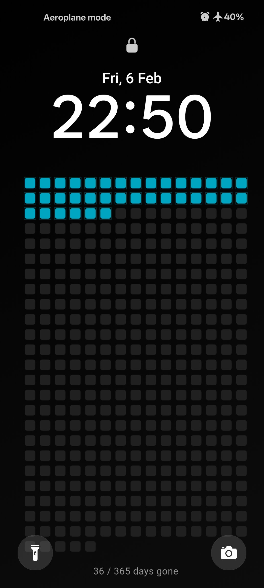

<div align="center">

  

  # Ticking ⏳
  
  **Visualize Your Time. Focus on Your Goal.**
  
  [](https://flutter.dev)
  [](https://www.android.com)
  [](https://github.com/Aditya-en/ticking/releases)

  <p>
    <b>Ticking</b> is a "Memento Mori" style live wallpaper generator. It turns your deadline into a visual grid of dots on your lock screen, helping you visualize the days passing and stay focused on your yearly goals.
  </p>

</div>

---

## 📸 Screenshots

| **The Editor** | **The Lock Screen** |
|:---:|:---:|
|  |  |
| *Customize colors, shapes, and layout* | *Clean, minimalist daily reminders* |


---

## ✨ Features

* **📅 Dynamic Grid System:** Automatically calculates the days passed vs. days remaining until your deadline.
* **🎨 Pro Customization:**
    * **Colors:** Choose from neon presets or create custom gradient backgrounds.
    * **Shapes:** Switch between Circles, Squares, and Rounded Squares.
    * **Typography:** Adjust text sizing, spacing, and shadows.
* **📐 Layout Control:** Adjust dot radius, spacing, and margins (Top/Side) to fit any phone screen perfectly.
* **🔄 Auto-Update:** A background service automatically updates your wallpaper every day to reflect the new count—no manual action required.
* **💾 Auto-Save:** Your preferences are saved locally and persist across app restarts.
* **⚡ Native Performance:** Built with Flutter for smooth rendering at high resolutions (1440px width).

---

## 📥 Download & Install

**Android Only**

1.  Go to the [Releases Page](https://github.com/Aditya-en/ticking/releases).
2.  Download the latest `app-release.apk`.
3.  Open the file on your phone.
4.  If prompted, allow **"Install from Unknown Sources"**.

---

## 🛠️ Built With

* [Flutter](https://flutter.dev/) - UI Toolkit
* [wallpaper_manager_plus](https://pub.dev/packages/wallpaper_manager_plus) - Setting the lock screen
* [workmanager](https://pub.dev/packages/workmanager) - Background tasks for auto-updates
* [shared_preferences](https://pub.dev/packages/shared_preferences) - Local data persistence
* [flutter_launcher_icons](https://pub.dev/packages/flutter_launcher_icons) - Icon generation

---

## 🚀 Getting Started (For Developers)

If you want to build this project locally:

1.  **Clone the repo**
    ```bash
    git clone [https://github.com/Aditya-en/ticking.git](https://github.com/Aditya-en/ticking.git)
    cd ticking
    ```

2.  **Install dependencies**
    ```bash
    flutter pub get
    ```

3.  **Run the app**
    ```bash
    flutter run
    ```

4.  **Build Release APK**
    *Note: You will need your own signing key to build a release version.*
    ```bash
    flutter build apk --release
    ```

---

## 📄 License

This project is open source and available under the [MIT License](LICENSE).
